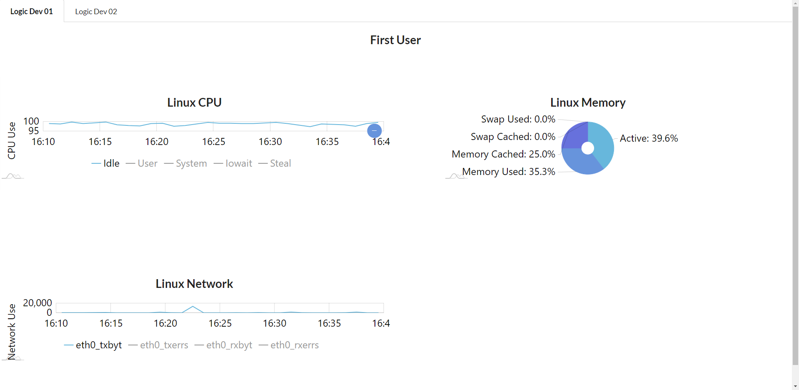

# Graphy

## **Abstract:**

_Use Amcharts & Graphite api to render chart data._

## **Installation Instructions:**

Open Your Terminal

### Copy and paste the following lines below into your terminal:

```bash
git clone https://github.com/GregGains/graphy.git
```

```bash
cd graphy/
```

```bash
npm install
```

```bash
cd client
```

```bash
npm install
```

```bash
cd ../
```

```bash
npm run dev
```

## **Project Background:**

This project integrates the amcharts library into React to display linux user information from the Graphite API.  Uses Express on the server-side to deliver API information.

## **Project Goals:**

- Interact with the AmCharts package to display API information.
- Design a back-end with Node.js & Express.
- Design a front-end user interface in React.
- Write understandable and well commented code.
- Unit test extensively.

## **Main View:**



